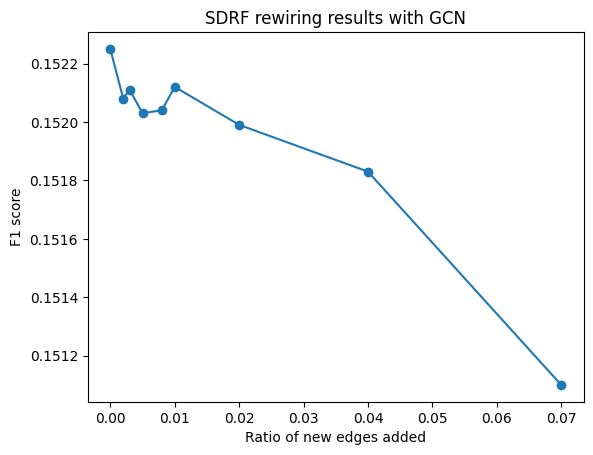
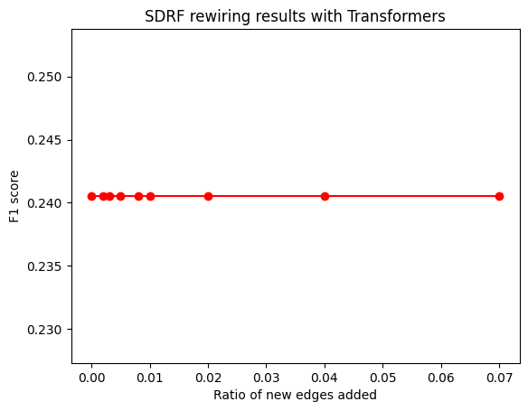
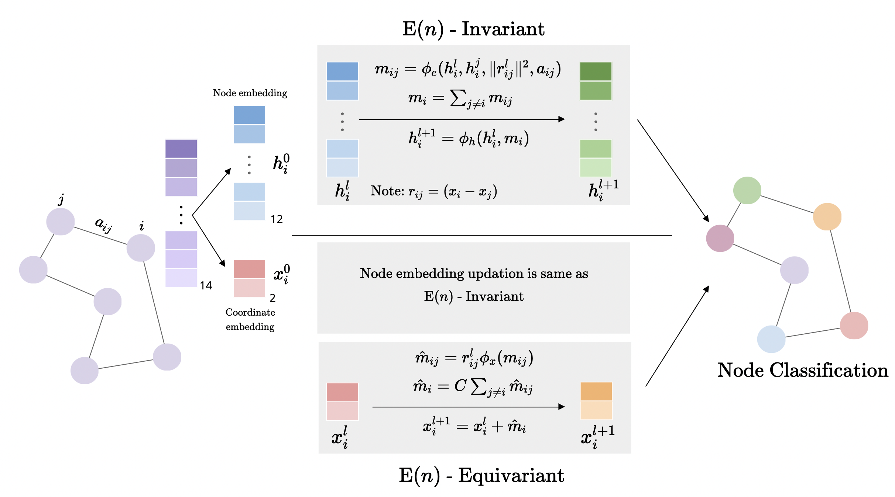
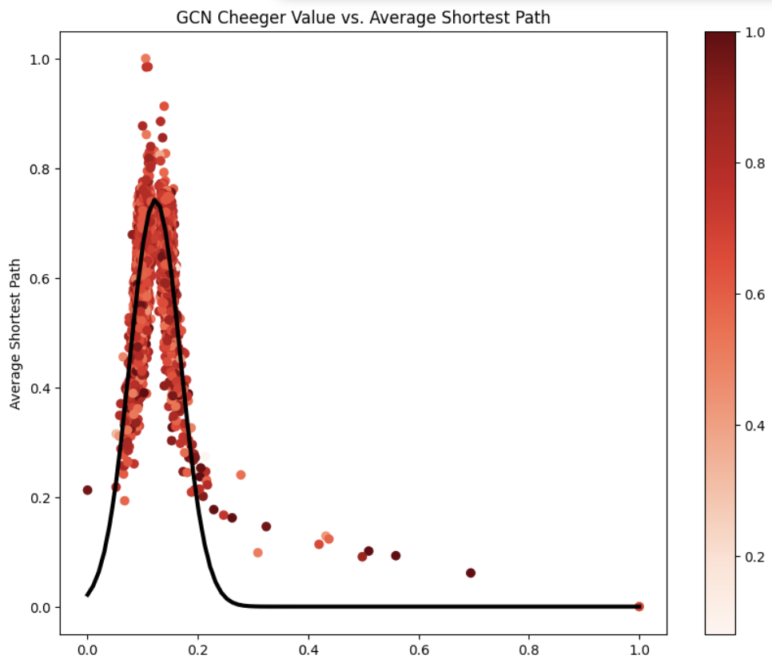
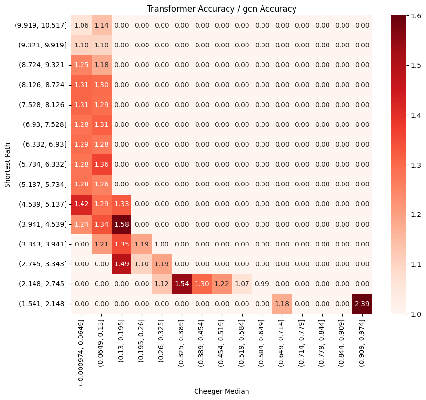
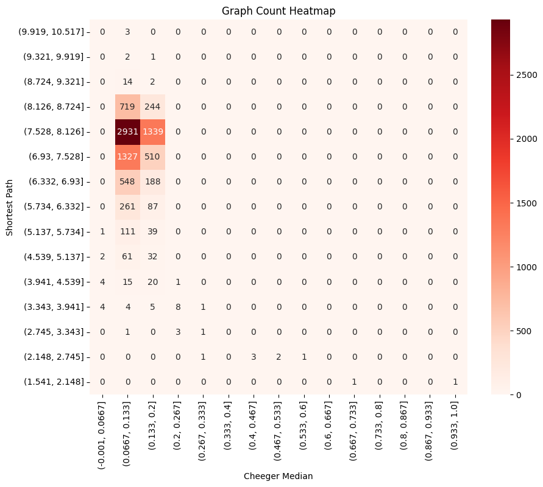
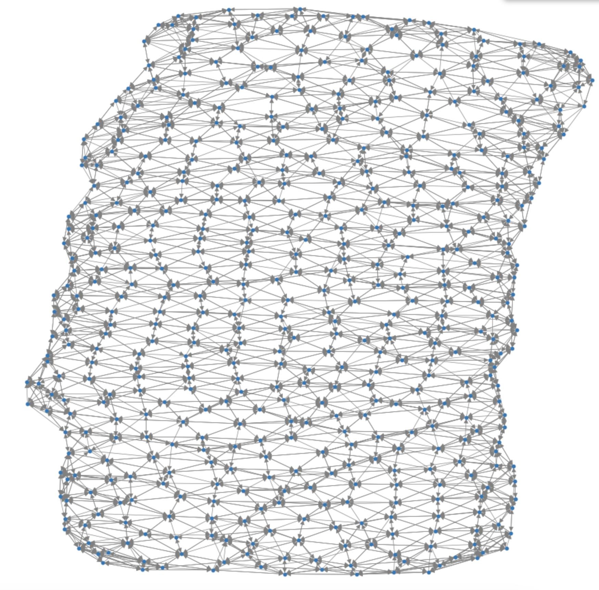
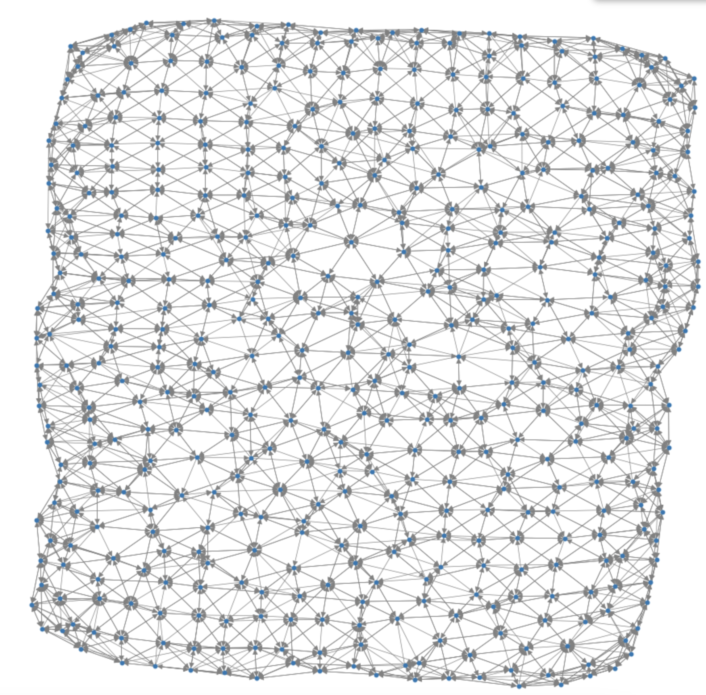
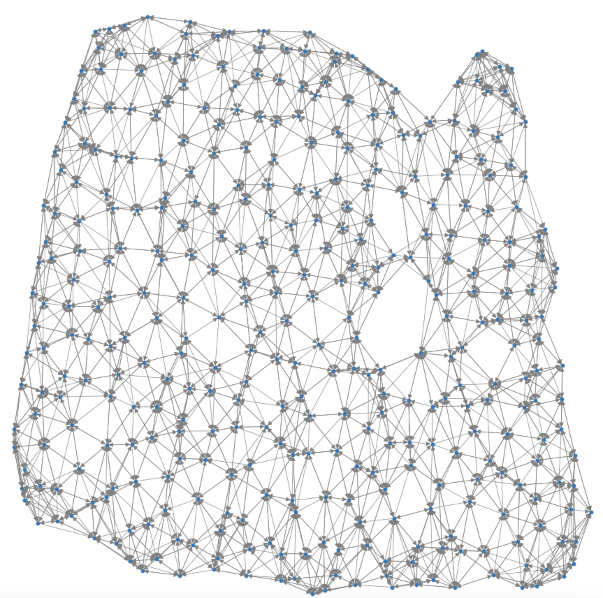
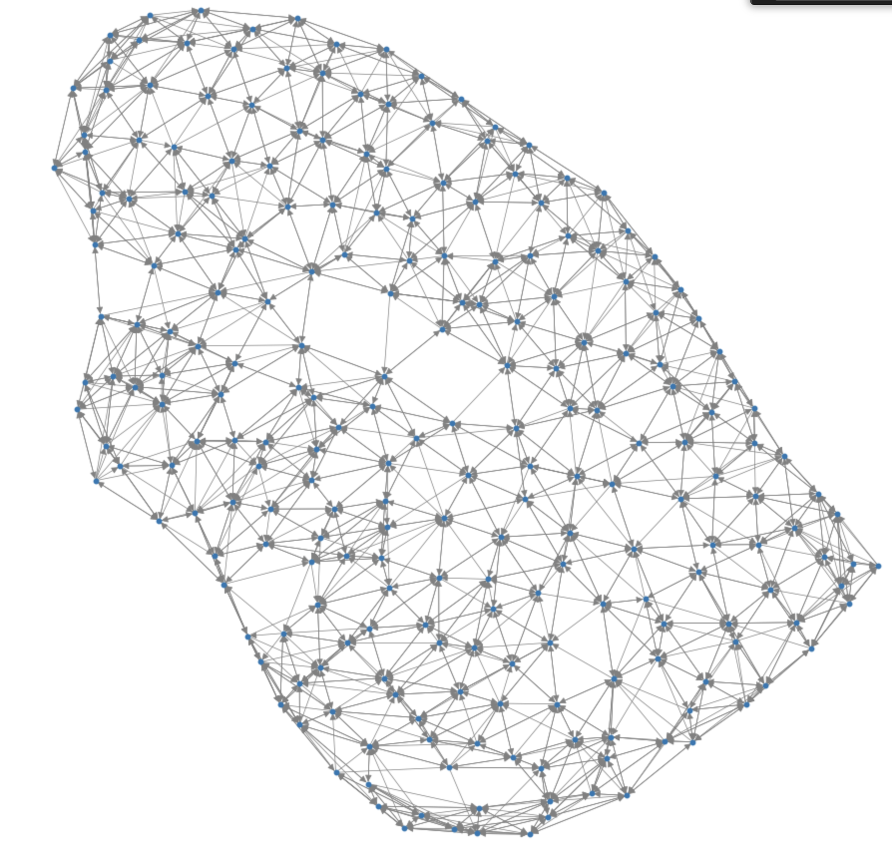

# 1. Introduction

##  Graph Neural Networks

A great number of systems in different branches of science can be described as sets, and relationships between the members of a set. For example, molecules are sets of atoms, which are related by their bonds; images are sets of pixels that are related by their relative positions. 

It's common to describe such systems mathematically as a 'graph'. Formally, a graph G is a pair of sets $(V, E)$ such that $E = {(v_i, v_j) | v_i, v_j \in V}$. $V$ is referred to as the vertices or nodes, and $E$ is referred to as the edges. Because this structure is so common, there has been considerable interest in designing neural network architectures that can perform inference effectively on graphs. 

Many neural networks that operate on graphs work within the ‘message passing’ paradigm, where each layer of the network is responsible for aggregating ‘messages’ - functions of the node features - that are passed from a node to its neighbours [[13]](#13). Adding depth to the network allows information from more distant nodes to be combined, as each subsequent layer allows information to be passed one edge further than the previous one. We allow weight sharing between all neighborhoods and allow the networks to process graphs with arbitrary sizes and topologies. However, this focus on local information can make it difficult to apply the Message Passing framework when interactions between distant nodes are important. We describe such datasets as exhibiting ‘long range interaction’ (LRI).  Some scenarios where message passing paradigm fails in some surprising ways on LRI problem:

1. Message passing neural networks (MPNNs) may <ins>'under-reach'</ins> if there aren't enough layers to allow important information to be combined from distant nodes.  
2. [[7]](#7) identified <ins>‘over-smoothing’</ins>, where adding too many layers to a MPNN can cause nearby nodes to have indistinguishable hidden features in the later layers of the network. This is especially an issue in the LRI  case, because a large number of layers is required for messages to reach between nodes that are far apart.
3. [[12]](#12) identified <ins>‘over-squashing’</ins>, where the graph topology induces bottlenecks that prevent the flow of information between different parts of the graph. Because each message in an MPNN has a fixed capacity, nodes with many neighbours may not be able to pass on all the useful information that they have access to. LRI tasks should therefore be harder to solve in topologies that have strict bottlenecks, because essential information is more likely to be lost while passing from node to node.

In the rest of the text, we refer to these three phenomena as the 'factors' that characterise the LRI problem.

# 2. The Long Range Graph Benchmark

## 2.1 The Datasets
The Long Range Graph Benchmark [[1]](#1) are a number of datasets that attempt to provide a common framework for testing and benchmarking new LRI methods. Putatively, these are real world datasets with tasks that can only be solved by successfully solving the LRI problem, and so provide an effective test of any new LRI method. The are five datasets are as follows:

-  __PascalVOC-SP__ and __COCO-SP__:: These are node classification datasets derived from [[8]](#8) and [[9]](#9) respectively. Each node corresponds to a region of the image belonging to a particular class. Each image is segmented into superpixels, and the task is to predict the class of the pixel. A graph is formed where the nodes correspond to each superpixel, the 14-dim node features are 12-dim RGB values and 2-dim coordinates of the center of mass of pixel locations. The edges correspond to which superpixels are contiguous in the image. 
- __PCQM-Contact__: This dataset is derived from a molecular dataset [[10]](#10), where each node is an atom, and the edges correspond to the molecular structure. The task is to predict pairs of distant nodes.  
- __Peptides-func__ and __Peptides-struct__: These datasets are derived from the dataset of peptides [[11]](#11). The authors define two tasks,  graph-level regression and graph-level classification, to predict molecular properties of the graph.

## 2.2 Are these truly ‘long range’ benchmarks?

The central claim of the paper is that the above datasets provide a benchmark for assessing whether a new method solves the LRI problem. While the paper doesn't explicitly describe what makes for a good benchmark, we believe the datasets should satisfy these criteria:
1. At least one of the three factors that we described as characterising LRI- under-reaching, over-smoothing and over-squashing, should be present in the dataset.
2. The majority of improvements in model performance on the benchmark should come from solving one of the above problems.

### 2.2.1 LRI by Construction

The authors argue that they construct their datasets in such a way that acheiving good performance on them requires solving the LRI problem. In one case, this is convincing: the PCQM-Contact dataset only considers interactions between distant nodes, and so cannot be solved by local information alone.

In the other cases, the justification is murkier. For example, they argue that classifying superpixels in the PascalVOC-SP and COCO-SP datasets is inherently long range, but they provide no argument for why this is the case.

Similarly, they argue that because 3D folding structure is important in determining properties of the molecules from Peptide graphs, and because 3D structures are determined by the interactions of multiple nodes, the Peptide datasets are inherently LRI. However, it's not clear whether how this dependence on 3D geometry can be understood in terms of over-squashing and over-smoothing, which have only been characterised as dependent on the graph topology. 

In summary, there isn't a strong _a priori_ reason to believe that any of the datasets are characterised by LRI, except for PCQM-Contact.

### 2.2.2 Relative outperformance of transformer methods

'Graph Transformer' architectures are a type of graph neural network which ignore the original input graph in favour of a fully connected one  [[14]](#14). Doing so allows them to sidestep each of the issues that characterise LRI problems. Since pairwise interactions are modeled between all nodes, there is no danger of under-reaching. Additionally, this also means we aren't compelled to include as many message passing layers, preventing over-smoothing. Finally, since there is a direct path between any pair of nodes in a fully connected graph, no other node can serve as a bottleneck, preventing over-smoothing. The authors showed that transformer architectures outperformed other methods in 4 out of the 5 datasets. While they interpreted this as evidence of LRI in the data, there could be other plausible explanations. Arguably, we should look for more direct evidence that improved performance was due to an ability to leverage long range information.

### 2.2.3 Graph statistics
The authors generated statistics characterising the graphs found in each dataset, such as the graph diameter, the average shortest path, and the number of nodes. They claim that high values of these statistics indicate LRI within the graph. However, it’s not clear whether these statistics actually capture features of the graph topology relevant to the LRI problem. A graph may have a large number of nodes, and a complex topology, but it doesn't follow that a task defined on that graph can only be solved by modeling global interactions. Therefore, we think these graph statistics need to be more directly linked with model performance before we can conclude that they are proof of LRI in the datasets.

# 3. Our Contributions

Our project attempts to address the weaknesses we identified in each of the above arguments. Our ultimate goals are:

1. To replicate the results of the original study. 
2. To explore alternative approaches to mitigate the problem of Long Range Interactions (LRI).
3. To give our reader greater confidence that these datasets are a suitable benchmark for LRI methods, in the sense that improvements on these benchmarks can be attributed to an increased ability to solve the LRI problem.
4. To provide a better characterisation of which of the three LRI factors were most important.

Because we had limited computational resources, we chose to focus on the PascalVOC-SP and COCO-SP datasets. We employ the models from geometric deep learning domain to see how they perform on these datasets. The issue however we faced is that the molecular datasets - PCQM-Contact, Peptides-func and Peptides-struct have no positional information hence we stick with the above two datasets as they have positional information associated with each node. 

# 4. Experiments

From the paper, we opt to train GCN and Transformer with Laplacian Positional Encodings (Transformer+LapPE). We were able to replicate the results using these models and we use them to test our hypothesis about the presence of LRI in the datasets.

Additionally, we look at addressing the LRI problem through other approaches in this section. In this process, we also experiment with few other models. For a uniform comparison of performance across models, we follow the convention of limiting the number of parameters to approximately 500k. We also deviate from the original paper in using a cosine learning rate scheduler rather than the default 'reduce on plateau' scheduler, because we face compatibility issues when using the latter. This does not affect our results substantively, but accounts for minor differences between our results and the original paper. Due to computational constraints, we use a subset of classes of COCO-SP dataset. 

## 4.1 Alternative approaches to mitigate LRI problem:

### 4.1.1 Stochastic Discrete Ricci Flow (SDRF) algorithm 

Since, one of the main problem of LRI in MP-GNNs is over-squashing, a quick survey revealed that many of the existing literature try addressing this issue with help of topological change in the graphs using rewiring methods. More recently, [[2]](#2) proposed a curvature-based rewiring method for graphs based on Ricci curvature in Riemannian geometry. They introduce this as the Stochastic Discrete Ricci Flow (SDRF) algorithm which adds new edges in places where a strongly negative curve exists in order to smoothen out 'bottlenecks'.

We implement the SDRF algorithm to rewire graphs in the PascalVOC-SP dataset. Since, the algorithm only takes into account the graph topology and remains agnostic to other features, there are no edge features for the new edges. Hence, in order to have a fair comparison, we first trained the GCN and Transformer+LapPE model on graphs with their edge features removed  and obtained a baseline F1 performance. We then proceeded with adding a certain percentage of total edges in each graph of the test dataset using SDRF algorithm and benchmarked the trained model. To determine if rewiring with SDRF is beneficial, we compare the resulting F1 scores with baseline.

|  | |
| -------- | -------- |
| <a id="fig1"> Figure 1 </a>: Obtained F1 score on adding a certain ratio of original edges for GCN.  | <a id="fig2"> Figure 2 </a>: Obtained F1 score on adding a certain ratio of original edges for Transformer+LapPE.  |

**Note** - baseline f1 is the case when no edges are added i.e. ratio 0.0

The results show that rewiring negatively affects the performance of GCN model. We attribute this outcome as the nature of the data which are 2D image superpixel graphs. Even though bottlenecks might exist in this space, connecting and passing information between disparate patches of an image might truly confuse the trained model. The F1 scores of the Transformer+LapPE model remains the same throughout, which was expected as this model fully-connects the graph regardlessly.

Even though this method didn't solve the over-squashing problem, the theory helps us to form intuitive experiments to visualize over-squashing as we show in [Section 5](#sec5).

### 4.1.2 Geometric deep learning: 
Owing to the failure of the SDRF algorithm to mitigate LRI problem, we explore architectures where instead of changing the semantic meaning of the graph by adding edges, we can make the features of the graph itself more expressive. One such domain where we can make the message passing approach of GNNs more expressive is Geometric Deep Learning (GEDL). 
   We specifically explore three GEDL models - E(n)-Invariant, E(n)-Equivariant [[16]](#16) and E(3) Steerable GNN [[17]](#17). 

#### E(n)-Invariant and E(n)-Equivariant GNN
   The 14-dimensional node embedding of the long-range PascalVOC-SP and COCO-SP datasets have 12-dimensional information related to the color of the node pixel while the other 2-dimensions convey the $x$ and $y$ coordinates of the node. Instead of treating these last two features as part of the node's "normal" feature, we treat it as the node's "positional" feature. In the case of E($n$)-invariant and E($n$)-equivariant architectures, we use type-0 representations (i.e. relative distances) to define the geometry of the graph.  In case of E($n$)-invariant, the messages are conditioned on distance and these are used to update the node embeddings layer by layer. While for E($n$) equivariant architecture, we also update the positional/coordinate embeddings of the node. [Figure 3](#fig3) highlights the architecture along with the message passing equations.
   
 __Result Discussion:__  In case of invariant function, information is removed hence the orientation can no longer be reconstructed from the output. Similarly, an equivariant function preserves information, since all geometric information is preserved throughout the network. We hope that E($n$)-invariant and E($n$)-equivariant architectures add a level of additional expressivity over the vanilla GCN, so they can perform better than GCN. This result is affirmed by our finding as seen in [Table 1](#tab1) and [Table 2](#tab2). Also, it makes sense that  E($n$)-equivariant network outperforms  E($n$)-invariant as E($n$)-equivariant is more expressive.  To see whether Jumping Knowledge techniques introduced in [[4]](#4) help to improve performance of  E($n$)-invariant and equivariant models, we implement two variants of it. JK1 denotes the jumping knowledge variant 1 where we concatenate hidden outputs of all layers. And JK2 denotes the jumping knowledge variant where we do maximum pooling of all the layers. [Table 3](#tab3) shows these results. The E(n)-Invariant model's F1 score is improved by concatenating/max pooling layer outputs. The E(n)-Equivariant model's F1-score does not improve by concatenating/max pooling. These techniques are usually applied to hep with over-smoothing but in case of E($n$)-invariant and equivariant we do not observe any drastical improvement by using them.
   
#### E(3) Steerable GNN
Steerable E(3) Equivariant Graph Neural Networks (SEGNNs) generalise equivariant graph networks, such that node and edge attributes are not restricted to invariant scalars, but can contain covariant information, such as vectors or tensors. With SEGNNs we are able to incorporate geometric and physical information in both the message and update functions. Here we take the 14-dimentional node embedding of the long-range  datasets and add another dimension of zeros to it thus making it 15-dimentional. Further we break down the node embedding into 12 type-0 vectors and 1 type-1 vector. The edge attributes are obtained via the spherical harmonic embedding of relative positions. The messages and feature updates are calculated as shown in the [Figure 4](#fig4). Also note that here we use steerable MLPs, which maps between steerable input and output vector spaces via the Clebsch-Gordan tensor product and applies non-linearities
afterwards. 

 __Result Discussion:__ From  [Table 1](#tab1) and [Table 2](#tab2) we can see that SEGNNs outperform E($n$)-Invariant and E($n$)-Equivariant models. We believe that main reason behind this is the fact that SEGNNs are able to incorporate the edge direction vectors of relative positionns during the calculation of message. This is unlike the E($n$) models which consider only the distance between any two nodes.Additionally we know that SEGNNs generalise equivariant graph networks, such that node and edge attributes are not restricted to invariant scalars, but can contain covariant information. 

| | 
| -------- | 
|  <a id="fig3"> Figure 3 </a>: E(n)-Invariant and E(n)-Equivariant Architecture  |  

| |
| -------- |
|  <a id="fig4"> Figure 4 </a>: SEGNN Architecture  |

### 4.1.3 Which models perform best?

The GEDL models  perform comparably to the transformer, even with few message passing layers. From  [Table 1](#tab1) and [Table 2](#tab2) we can see that SEGNNs outperform E($n$)-Invariant and E($n$)-Equivariant models but has marginally lesser F1 score than transformer on PascalVOC-SP dataset. Note that due to computational constraints, we couldn't train the SEGNN model till loss convergence. So we see a promising higher performance of SEGNN compared to transformers. We hypothesize that the reason SEGNNs perform so well because of incorpation of directional information in the messages  as well the fact that the messages are modelled to be E(3) equivariant. 
 
 The results imply that the Geometric Deep Learning can be an exciting and novel viewpoint to look at the LRI problem. The advantage being, that we can make precise use of domain-specific graph information such as directional information, to make the graph interactions more expressive. A future work for us can be to define more specific experiments to study and quantify the relationship between LRI and GEDL models. 
 

|  |  | 
| -------- | -------- | 
|  <a id="tab1"> Table 1 </a>: Results for PascalVOC-SP dataset | <a id="tab2">Table 2 </a>: Results for COCO-SP dataset  |

|  |
| ------------- | 
| <a id="tab3">Table 3 </a>: Results for Jumping Knowledge Representations (JK) for PascalVOC-SP dataset |

## 4.2 Influence Scores: Is performance correlated with increased importance of distant nodes?

If the PascalVOC-SP and COCO datasets was truly characterised by LRI, we should expect two things:
- for models that treat distant nodes the same way as nearby ones (like transformers), we expect that the features of those distant nodes are important to the accuracy of their predictions.
- for local architectures with $L$ total layers, we expect that the importance of nodes should be roughly equal for all nodes that are less than or equal $L$, and 0 after that.

To test these hypotheses, we utilise the concept of  __influence score and distribution__ from [[4]](#4) to quantify the importance of nodes at different distances from each target node. Briefly, if we let $h_v^{(0)}$ be the input features associated with node $v$, and we let $y_u^{(i)}$ be the $i^{th}$ logit calculated during the classification of node $u$, then the influence of $v$ on $u$ is calculated as:

$$ I(u, v) = \sum_i | \frac{\delta  y_u^{(i)}}{\delta h_v^{(0)} } | $$

Where the individual gradients are obtained empirically through torch.autograd - PyTorch’s automatic differentiation engine .

To ensure that we could compare influence scores between models, we normalised the scores for each target node across all other nodes. That is, letting $I(u, v)$ be the influence of $v$ on node $u$, we computed the normalised influence score as:

$$ \tilde{I}(u, v) = \frac{I(u, v)}{\sum_i I(u, v_i)} $$

The results of this analysis are shown in [Figure 5.1](#fig5_1) and [Figure 5.2](#fig5_2) . The x-axis shows various path lengths, and the y-axis shows the normalised influence scores, averaged across all choices of target node for all graphs in the dataset.

@Avik discussing influence scores graphs
We can see that the influence scores for transformers are high for longer distances. This is mainly because they work on a fully connected graph. Additionally we see that SEGNNs also have a nonzero influence score for a longer distance which we attribute to the presence of residual connections in the network architecture.

| | |
| -------- | -------- |
| <a id="fig5_1"> Figure 5.1 </a>: Influence Scores for PascalVOC-SP | <a id="fig5_2"> Figure 5.2 </a>: Influence Scores for COCO-SP  |

##  4.3 Noising Experiment:  Are distant nodes important for achieving good accuracy?

While the above analysis shows that the predictions of our transformer are affected by distant nodes, it does not necessarily follow that _accurate_ predictions depend on the information in those nodes. From [Table 1](#tab1) we saw that the transformer has a very large gap in performance between the train and test data compared to the other models. Therefore, it's possible that the transformer is over-fitting to distant nodes, and they are unimportant when generalising to the test set.

To test this hypothesis explicitly, we test how the accuracy of our models change when we replacedthe input features at a specific distance (as measured by shortest path) from the target node with the mean input features of the dataset. This corresponds to evaluating the accuracy of the _expected_ prediction when only a subset of the information is known. That is, let $x\_d$ denote all the input features, at distance $d \in \{ 1, ... D \}$ from the target node. Also, denote $x_{\bar{d}} = \{ x_i, i \neq d \}$ . Then we measure the accuracy of the model $f_d(x)$ given by:

$$ f_{d}(x) =  E_{X_1, ..., X_D}[f(x) | X_{\bar{d}}] $$
 
 The argument was inspired by [[15]](#15). Therefore, if there is useful information in distant nodes, we expect to see a large drop in accuracy when we replace the features of those nodes.  The results are reported in [Figure 6.1](#fig6_1), where the y-axis shows either the accuracy or macro-weighted f1 score as a proportion of what is obtained when the original input features are used.

__Result Discussion__: The transformer leverages distant nodes more effectively than the GCN, even at distances that the GCN can 'reach'. This may indicate that the GCN is suffering from over-squashing, although it is not conclusive. There appears to be no useful information beyond path lengths of ~8, even for transformers. For both the GCN and the transformer, there is a mismatch between the maximum distance at which we obtain significant influence scores, and the maximum distance that affects accuracy. This indicates that at least some of the observed influence of distant nodes is 'spurious' in that it affects the model's predictions without increasing accuracy.

|  | | 
| -------- | -------- |
| <a id="fig6_1"> Figure 6.1: </a> Relative accuracy obtained when replacing node features at different distances with baseline value | <a id="fig6_2"> Figure  6.2: </a> Relative F1 score obtained when replacing node features at different distances with baseline value  |  

#  <a id = "sec5"> 5. Qualitative Experiments  </a>
## 5.1 Does model performance correlate with graph qualities that predict over-squashing?

The original paper [[1]](#1) claim that their datasets were good benchmarks for LRI based on three statistics of the graphs they contained: the average shortest path distance between nodes in the graph, the graph diameter, and the number of nodes. We hypothesize that if these statistics were indicative of the presence of long range interactions in the dataset, then we would be able to correlate them with the relative performance of different models.

While it's not clear that the statistics we mentioned are related to over-squashing, we also investigate an alternative statistic that has a stronger theoretical relationship with over-squashing. [[2]](#2) has shown that the degree of over-squashing can be measured by the Cheeger constant $h_G$ of a graph G which is defined as:

$$h_G = \min_{S \subseteq G} h_S \text{  where  }  h_S = \frac{\lvert\delta S \rvert}{\min vol(S), vol(V/S)}$$

where the _boundary_  $\lvert\delta S \rvert$ is defined as the set of edges 'leaving S' $\delta S = \{ (i, j) : i \in S, j \not\in S\}$ and the _volume_ $vol(S) = \sum_{i \in S} \text{degree}(i)$. In other words, the Cheeger constant is small when we can find two large sets of vertices with sparse intersection, $S$ and $V\setminus S$, such that there are few edges going between them which forms a bottleneck. 

A 'stretched' out graph would have a low Cheeger constant but high average shortest path. However, a low average shortest path would imply that there are many pairs of nodes that are close together, and so we would expect that the graph is not stretched out and that the graph would have sparse connections between clusters. Therefore, we expect that a low Cheeger constant and low average shortest path together to be indicative of over-squashing.

[[2]](#2) show that $2h_G$ is an upper bound for the minimum 'balanced Forman curvature' of the graph, a quantity that describes how 'bottlenecked' the neighbourhood of each edge in the graph is in terms of the number of cycles it appears. The negative values for a given edge $(i,j)$ can be interpreted as indicating that this edge forms a 'bridge' between two sets of vertices. In turn, this curvature controls how effectively gradients can populate through each neighbourhood of the graph (one possible definition of over-squashing). Finally, although the exact Cheeger value is infeasible to compute, the first eigenvalue $\lambda_1$ of the graph Laplacian is a strict upper bound for $2 h_G$. 

In summary, we expect that graphs with low Cheeger values should suffer more from over-squashing.

### 5.2 Do average shortest path and graph diameter correlate with model performance?
We observe no correlation between the relative performance of any of the models and the average shortest path nor the diameter. This affirms our suspicion that this statistic is not indicative of the presence of LRI in the dataset.

|  |  | 
| -------- | -------- | 
|  <a id="tab4"> Table 4 </a>: Accuracy against ASP | <a id="tab5">Table 5 </a>: Accuracy against diameter |

However, by plotting the distribution of average shortest path against the Cheeger constant and measuring the correlation between the distribution and the performance of the models, we find a positive correlation between the distribution and the performance in the LRI sensitive models.
|  |  | 
| -------- | -------- | 
|  <a id="tab6"> Table 6 </a>: Correlation between accuracy and the graph distribution | <a id="fig7"> Figure 7 </a>: Cheeger Value vs Average Shortest Path Distribution for GCN |

When we measure accuracy against average shortest path with control over the Cheeger constant, we find no correlation between the average shortest path and the accuracy of the models.

We also measure the ratio between transformer accuracy against each model's accuracy along the distribution of graphs. We notice that lower average shortest path translate to better performance of transformer against the other models when we control the Cheeger constant ([Figure 8](#fig8)).

|  | | 
| -------- | -------- | 
|  <a id="fig8"> Figure 8 </a>: Graph Transformer's heatmap for Cheeger Value vs Average Shortest Path | <a id="fig9"> Figure 9 </a>: Graph Count heatmap for Cheeger Value vs Average Shortest Path|

## 5.3 Qualitative investigation of graph characteristics 
To affirm our hypothesis, we conduct a qualitative analysis. We sample graphs from different bins of the average shortest path-Cheeger constant distribution to examine their bottleneck behaviour. We see that the relationship between Cheeger constant and average shortest path accords with our theory.
When we fix the Cheeger constant between $0.0667$ and $0.133$, and order the graph's average shortest path from top to bottom, we get the following:
|  |  |  |
| -------- | -------- | -------- |
|   |  |  |

We begin seeing graphs with sparse connections along average shortest path 6.93 as seen in [Figure 9](#fig9). Both the qualitative analysis and the accuracies analysis suggest that graphs with high LRI would have low Cheeger constant and average shortest path of length 6.93 and below. However, as can be seen, the majority of graphs in the dataset do not suffer from bottlenecking.

# 6. Conclusion

The goals of this study were to replicate the results of the original study, provide alternative approaches to mitigate the problem of LRI and to provide a better characterisation of which of the three LRI factors were most important and finally to assess whether the LRGB was indeed a good benchmark for LRI. The first two of these were met unequivocally, whereas the other two deserve more qualified discussion.

## 6.1 Which LRI factors are most prevalent?
The only LRI factor we found unequivocal evidence for was 'under-reaching'. We showed that the predictions of transformer models were heavily influenced by distant nodes. Moreover, we showed that distant nodes (up to 8 hops away) had a meaningful influence on the accuracy of those predictions. This shows that our method can be used to place a lower bound on the length of interaction on a candidate LRI dataset, although this is only possible on node-level tasks. We find little evidence for over-squashing in the datasets. If this had been present, we expected that we would find a relationship between the Cheeger constant and the relative accuracies of the transformer and GCN. Moreover, our qualitative exploration of the dataset made us doubt that over-squashing could be meaningfully captured by any simple topological statistics.

## 6.2 Is the LRGB a good benchmark?

We can give a qualified yes: it's true that there is useful information in distant nodes, and a model can improve its performance on this dataset by leveraging that information. However, there are two important caveats: the first is that a model can drastically improve its performance even while only focussing on local information. Secondly, we see no evidence to believe that over-squashing is an issue in these datasets. Overall, we believe there needs to be a more compelling argument made linking properties of these datasets to the theoretical causes of oversquashing before this is considered a 'benchmark' for oversquashing.

## 6.3 GEDL Models
Current results show that GEDL models outperform GCN, hinting us that their expressivity due to geometrical information helps mitigate LRI problem. We see promise in further exploring how GEDL models can be used to solve LRI problem in various other graph domains where we have directional information, such as long sequences of molecules. 

# 7. Individual Contributions

1. **Amity**: She was responsible for the qualitative analysis of the graphs and the analysis of the average shortest path and Cheeger constant against the accuracy results. She also wrote the metrics required for the graphs analysis.
 She also helped with the blogpost.
1. **Nik Mather**: He performed the experiments relating shortest path distance to influence score distribution, F1-score and accuracy (although he relied on Madhura and Avik for the implementation of influence score's computation). He assisted in writing the code for the Cheeger value experiments. Additionally, he structured and drafted the majority of the content of the blogpost. 
2. **Avik Pal**: He and Madhura reproduced the original paper's experiments. He additionally carried out experiments related to rewiring, implemented the E($n$)-Equivariant model and worked on influence score computation. He also helped with his part in the blogpost.
3. **Aditya Prakash Patra**: He wrote the code for SEGNN model along with performing all the experiments and ablations associated with it. He also contributed in writing his assigned section in the blogpost. 
4. **Madhura Pawar**: She was responsible for reproducing the original experiments, building and maintaining the code infrastructure. She and Avik fixed quite some issues which we faced while trying to get the original code up and working. She implemented the E($n$)-Invariant model. Along with scripting and programming experiments which her colleagues needed, she was involved in creating illustrative architecture diagrams for the blogpost. Finally, she also helped proofread the blog and made necessary edits.

# References
<a id="1">[1]</a> 
Dwivedi, Vijay Prakash et al. “Long Range Graph Benchmark.” ArXiv abs/2206.08164 (2022): n. pag.

<a id="2">[2]</a> 
Jake Topping, Francesco Di Giovanni, Benjamin Paul Chamberlain, Xiaowen Dong, Michael M. Bronstein: Understanding over-squashing and bottlenecks on graphs via curvature. ICLR 2022

<a id="3">[3]</a>
Satorras, Victor Garcia et al. “E(n) Equivariant Graph Neural Networks.” International Conference on Machine Learning (2021).

<a id="4">[4]</a>
Xu, Keyulu et al. “Representation Learning on Graphs with Jumping Knowledge Networks.” International Conference on Machine Learning (2018).

<a id="5">[5]</a>
Brandstetter et al. "Geometric And Physical Quantities Improve E(3) Equivariant Message Passing"

<a id="6">[6]</a>
Ravi Montenegro and Prasad Tetali "Mathematical Aspects of Mixing Times in Markov Chains"

<a id="7">[7]</a>
Li, Qimai et al. “Deeper Insights into Graph Convolutional Networks for Semi-Supervised Learning.” AAAI Conference on Artificial Intelligence (2018).

<a id="8">[8]</a>
Everingham, Mark et al. “The Visual Object Classes (VOC) Challenge.” International Journal of Computer Vision 88 (2010): 303-338.

<a id="9">[9]</a>
Lin, Tsung-Yi et al. “Microsoft COCO: Common Objects in Context.” European Conference on Computer Vision (2014).

<a id="10">[10]</a>
Hu, Weihua et al. “OGB-LSC: A Large-Scale Challenge for Machine Learning on Graphs.” ArXiv abs/2103.09430 (2021): n. pag.

<a id="11">[11]</a>
Singh, Sandeep et al. “SATPdb: a database of structurally annotated therapeutic peptides.” Nucleic Acids Research 44 (2015): D1119 - D1126.

<a id="12">[12]</a>
Alon, Uri, and Eran Yahav. "On the bottleneck of graph neural networks and its practical implications." arXiv preprint arXiv:2006.05205 (2020).

<a id="13">[13]</a>
Bronstein, Michael M., et al. "Geometric deep learning: Grids, groups, graphs, geodesics, and gauges." arXiv preprint arXiv:2104.13478 (2021).

<a id="14">[14]</a>
Dwivedi, Vijay Prakash and Xavier Bresson. “A Generalization of Transformer Networks to Graphs.” ArXiv abs/2012.09699 (2020): n. pag.

<a id="15">[15]</a>
Lundberg, S. M., & Lee, S. I. (2017). A unified approach to interpreting model predictions. Advances in neural information processing systems, 30.

<a id="16">[16]</a>
Satorras, Victor Garcia et al. “E(n) Equivariant Graph Neural Networks.” International Conference on Machine Learning (2021).

<a id="17">[17]</a>
Brandstetter, Johannes et al. “Geometric and Physical Quantities improve E(3) Equivariant Message Passing.” ArXiv abs/2110.02905 (2021): n. pag.
